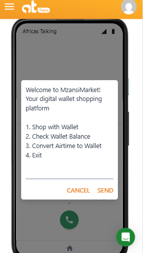
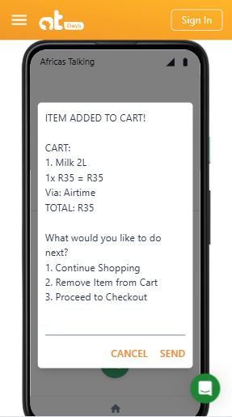
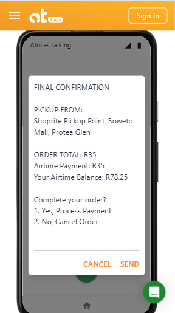

# MzansiMarket USSD Service

High-performance USSD shopping application optimized for **Africa's Talking** gateway.

## 📸 Screenshots

### Main Menu



### Shopping Flow



### Order Confirmation



## 📄 Key Features

- ✅ Full shopping cart management
- ✅ Multiple payment methods (Airtime/Account)
- ✅ Home delivery and store pickup options
- ✅ Balance checking (Account & Airtime)
- ✅ Session persistence across interactions
- ✅ Africa's Talking timeout prevention

## 🚀 Quick Start

### Installation

```bash
git clone https://github.com/telkom-10x-devs/mzansimarket-ussd-service.git
cd mzansimarket-ussd-service
```

### Setup

```bash
npm run dev
```

### Africa's Talking Configuration

- Set callback URL to: `https://your-domain.com/`
- Configure your USSD shortcode in AT dashboard

## 📱 USSD Flow

```
*123# → Main Menu
├── 1. Buy Products → Login → Shop → Cart → Checkout → Delivery
├── 2. Account Balance → Login → Show Balance
├── 3. Airtime Balance → Login → Show Airtime
└── 4. Exit
```

## 🧪 Test Credentials

| ID         | Password    | Account Balance | Airtime Balance |
| ---------- | ----------- | --------------- | --------------- |
| 1234567890 | password123 | R1,500.00       | R120.50         |
| 0987654321 | mypass456   | R2,300.50       | R85.30          |
| 5555555555 | test123     | R800.25         | R45.75          |

## 🔌 API Endpoints

### POST /ussd

Main USSD handler for Africa's Talking

```json
{
  "sessionId": "ATUid_123",
  "serviceCode": "*123#",
  "phoneNumber": "+254712345678",
  "text": "1*2*3"
}
```

### GET /ussd/test

Health check endpoint - returns system status and performance metrics

## 🔧 Troubleshooting

### "Network experiencing technical problems"

- **Check response time**: Must be <5 seconds
- **Verify response format**: All responses must start with `CON` or `END`
- **Check server logs**: Look for unhandled errors

### Test Performance

```bash
curl -w "Response time: %{time_total}s\n" http://localhost:8000/test
```

---

# MzansiMarket USSD Service

High-performance USSD shopping application optimized for **Africa's Talking** gateway.
